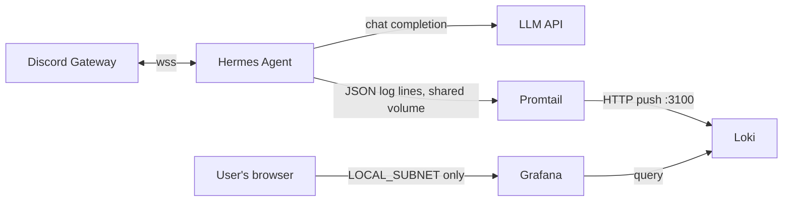

# Architecture

## Components

| Component | Role | Network exposure |
|---|---|---|
| Hermes Agent (`hermes_agent/`) | discord.py bot + OpenAI-compatible LLM client; sandboxed file tools | `agent-net` — the one container allowed outbound internet, to the Discord Gateway and the configured LLM API |
| Loki (`config/loki-config.yaml`) | Log storage | `obs-net` only — no internet, see Trust boundaries |
| Promtail (`config/promtail-config.yaml`) | Tails the shared `hermes-logs` volume, ships lines to Loki | `obs-net` only — no internet |
| Grafana (`dashboards/hermes-overview.json`) | Dashboards over Loki: errors/min, task latency p50/p95, token usage, tool calls, live log stream | `obs-net` + one published host port (`GRAFANA_PORT`), firewalld-restricted to `LOCAL_SUBNET` |
| Sandboxed workspace (`hermes_agent/tools.py`, `./workspace`) | File read/write tools the LLM can call | No network role — a filesystem boundary, not a network one |

## Trust boundaries

- **Discord message → LLM:** every inbound message is treated as untrusted input to the model, not
  as instructions to the agent process itself. The agent never executes shell commands or arbitrary
  code derived from a message — the only actions available to the LLM are the three tools in
  `config/hermes.example.yaml`'s `tools.allowed` list.
- **LLM response → filesystem:** `hermes_agent/tools.py`'s `WorkspaceTools._resolve()` is the one
  place a prompt-injected or hallucinated file path (e.g. `../../etc/passwd`) gets checked and
  rejected, on every call, not just at startup. This is the sandbox boundary for the one tool
  category the agent has.
- **Secrets → config:** `hermes_agent/config.py` reads `DISCORD_TOKEN` and `LLM_API_KEY` from the
  environment only, never from `hermes.yaml`. A leaked or accidentally-committed YAML config file
  cannot leak a credential, because the credential was never representable there.
- **agent-net vs. obs-net:** this is a deliberate, documented exception to this workspace's default
  "air-gapped container lab" posture (see `docs/SECURITY.md`). Hermes's entire purpose requires
  reaching the Discord Gateway and an LLM API, so `agent-net` is left open. `obs-net`
  (Loki/Promtail/Grafana) has no such requirement and stays firewalld-blocked from the internet —
  the exception is scoped to exactly the one container that needs it, not the whole stack.
