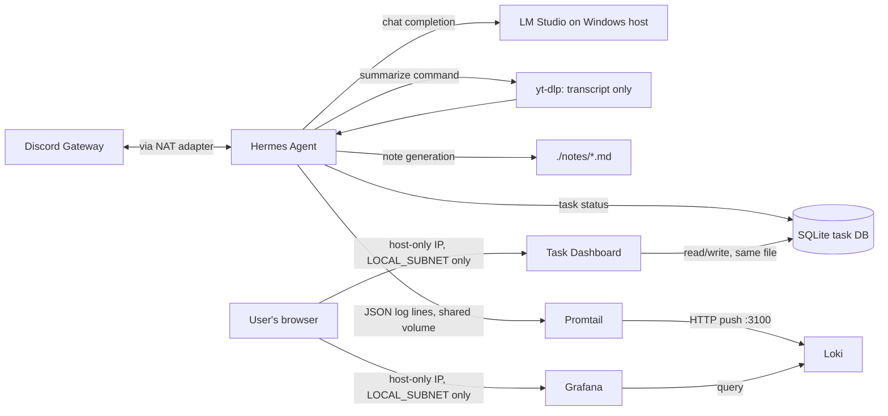

# Architecture

`C` defaults to LM Studio running on the Windows host, reached over VirtualBox's host-only adapter
(`host.docker.internal` → `HOST_LM_STUDIO_IP`, same pattern as `ai-cybersecurity-devops-lab`) — swap
`LLM_API_BASE`/`LLM_API_KEY` in `.env` for a cloud provider instead if you'd rather not run a local
model.

## Components

| Component | Role | Network exposure |
|---|---|---|
| Hermes Agent (`hermes_agent/`) | discord.py bot + OpenAI-compatible LLM client; sandboxed file tools; transcript/notes/task pipeline | `agent-net` — the one container allowed outbound internet, to the Discord Gateway, LM Studio on the Windows host, and YouTube (for transcript fetching via `yt-dlp`) |
| Loki (`config/loki-config.yaml`) | Log storage | `obs-net` only — no internet, see Trust boundaries |
| Promtail (`config/promtail-config.yaml`) | Tails the shared `hermes-logs` volume, ships lines to Loki | `obs-net` only — no internet |
| Grafana (`dashboards/hermes-overview.json`) | Dashboards over Loki: errors/min, task latency p50/p95, token usage, tool calls, live log stream | `obs-net` + one published port (`GRAFANA_PORT`), reached via the VM's host-only IP and firewalld-restricted to `LOCAL_SUBNET` — no NAT port-forward (see `docs/INSTALL.md` for why) |
| Sandboxed workspace (`hermes_agent/tools.py`, `./workspace`) | File read/write tools the LLM can call | No network role — a filesystem boundary, not a network one |
| Task DB (`hermes_agent/services/task_db.py`, `./data/tasks.db`) | Local SQLite table tracking `Backlog`/`In Progress`/`Completed`/`Failed` task status | No network role; not a real AppFlowy/Affine integration, deliberately — see Trust boundaries |
| Notes service (`hermes_agent/services/notes_service.py`, `./notes/`) | Generates structured markdown notes from a transcript via the LLM, writes them to disk | No network role beyond the LLM call already covered above |
| Task Dashboard (`task_dashboard/`) | Browser UI to view, add, edit, and delete tasks in the same SQLite file `task_db.py` uses | `obs-net` + one published port (`TASK_DASHBOARD_PORT`) — same firewalld-restricted-to-`LOCAL_SUBNET`, no-NAT-forward posture as Grafana. No outbound internet, since it never needs to reach anything beyond the local SQLite file. |

## Chat platform adapters

Built around one shared interface (`hermes_agent/adapters/base.py`'s `ChatAdapter`), so
`hermes_agent/bot/commands.py` contains the actual command logic exactly once, regardless of which
platform a message arrived from — adding a platform later means writing one new adapter module, not
touching command logic.

**Discord is fully supported.** **Revolt is scaffolded but not currently functional** — the adapter
code exists (`hermes_agent/adapters/revolt_adapter.py`), but `revolt.py` (the only readily-available
Python Revolt library at the time this was built) hard-pins dependencies (`aiohttp==3.7.4.post0`,
`typing-extensions==4.0.1`) that conflict with `openai`'s own requirements — confirmed via two
separate `pip install` failures, not a style choice. This is an accepted, documented gap (see
`hermes_agent/requirements.txt`), not dead code to clean up: setting `REVOLT_TOKEN` without the
package installed raises a clear `RuntimeError` at startup (`hermes_agent/main.py`) rather than a
confusing import crash, and Discord-only operation is entirely unaffected by Revolt's absence.

## The `summarize`/`task` pipeline

1. `!hermes summarize <url>` immediately replies `[Task Queued]` and creates a task row in the local
   SQLite DB (`In Progress`), then hands off to a background `asyncio` task so the bot's
   message-handling loop isn't blocked for however long transcript fetching + note generation takes.
2. `TranscriptService` (`hermes_agent/services/transcript_service.py`) uses `yt-dlp` to fetch
   **existing captions only** — manual or auto-generated — never downloads audio/video and never
   runs speech-to-text. A video with no captions raises `NoTranscriptAvailable`, replied back as a
   clear `[Task Failed]` message rather than hanging or silently doing nothing.
3. `NotesService` (`hermes_agent/services/notes_service.py`) sends the transcript to the same LLM
   backend as plain chat, with a prompt requesting a fixed three-section markdown structure
   (Executive Summary / Key Takeaways & Action Items / Full Reference Notes), and saves the result
   under `./notes/<task_id>-<slug>.md`.
4. The task's status is updated to `Completed` (or `Failed`), and a proof-of-work reply is sent back
   to the originating channel with the note's filename, word count, and processing time.

**Deliberately deferred:** audio-only videos (no existing captions) are not transcribed via Whisper
or any other speech-to-text model. That's a real, scoped-out follow-up, not an oversight — adding it
means a real model/container running inside `agent-net`, which is worth doing once there's an actual
need for it rather than upfront. The current behavior (a clear `[Task Failed]` message) makes that
gap visible rather than hiding it behind a hang or a generic error.

**Transcripts are truncated to fit the LLM's context window, not chunked/summarized in parts.**
`NotesService` truncates to `MAX_TRANSCRIPT_CHARS` (default `20000`, configurable) before sending to
the LLM — confirmed live: an untruncated transcript on an 8K-context local model fails with
`exceeds the available context size`, a hard LLM-side error, not a soft limit. Truncating to the
start of the video, rather than chunking the whole transcript and summarizing each piece, is an
accepted simplification: chunked summarization is real additional complexity (merging partial
summaries coherently) that isn't justified until there's an actual need for full-length coverage of
long videos. A truncated note says so explicitly in its own content, rather than silently covering
less than the user would assume.

## Task dashboard

`task_dashboard/` is a small standalone FastAPI service (its own container, its own Dockerfile —
see `docker-compose.yml`) giving a browser view of the same task board the Discord `task`/
`summarize` commands write to: list tasks by status, add one with a title/description, change its
status, or delete it. It talks to `./data/tasks.db` directly, not through `hermes-agent` — see
`task_dashboard/db.py`'s module docstring for why it's a standalone copy of the schema/pragmas
rather than an import of `hermes_agent/services/task_db.py` (separate Docker build contexts; the
only thing meant to be shared is the file, not the code — if the schema changes in one, mirror it in
the other).

**Deliberately not yet a queue Hermes drains.** Adding a task from the dashboard puts it in
`Backlog`, visible there and over `!hermes task` lookups, but `hermes-agent` has no background
poller watching for new `Backlog` rows and does not act on a dashboard-created task on its own — it
only ever creates/updates tasks in direct response to a Discord command (`_handle_task`/
`_handle_summarize` in `hermes_agent/bot/commands.py`). This is scoped out for now rather than an
oversight: "ingest and act on a task created elsewhere" is a real feature (a polling loop, a way to
decide what kind of task it is and what pipeline to run) worth building once there's an actual
workflow that needs it, not speculatively. Today the dashboard's value is organizing/viewing what's
already there and a faster way to jot a task than a Discord command — not autonomous pickup.

## Trust boundaries

- **Discord message → LLM:** every inbound message is treated as untrusted input to the model, not
  as instructions to the agent process itself. The agent never executes shell commands or arbitrary
  code derived from a message — the only actions available to the LLM are the three tools in
  `config/hermes.example.yaml`'s `tools.allowed` list.
- **LLM response → filesystem:** `hermes_agent/tools.py`'s `WorkspaceTools._resolve()` is the one
  place a prompt-injected or hallucinated file path (e.g. `../../etc/passwd`) gets checked and
  rejected, on every call, not just at startup. This is the sandbox boundary for the one tool
  category the agent has.
- **Secrets → config:** `hermes_agent/config.py` reads `DISCORD_TOKEN` and `LLM_API_KEY` from the
  environment only, never from `hermes.yaml`. A leaked or accidentally-committed YAML config file
  cannot leak a credential, because the credential was never representable there.
- **agent-net vs. obs-net:** this is a deliberate, documented exception to this workspace's default
  "air-gapped container lab" posture (see `docs/SECURITY.md`). Hermes's entire purpose requires
  reaching the Discord Gateway and an LLM API, so `agent-net` is left open. `obs-net`
  (Loki/Promtail/Grafana) has no such requirement and stays firewalld-blocked from the internet —
  the exception is scoped to exactly the one container that needs it, not the whole stack.
- **User-supplied URL → outbound fetch:** the `summarize <url>` command passes a user-controlled URL
  straight to `yt-dlp`, which can fetch from many sites, not only YouTube. This is an accepted,
  bounded risk rather than a gap: `hermes-agent` already has open egress on `agent-net` by design (to
  reach Discord and an LLM API), so a user directing it to fetch an arbitrary URL doesn't grant
  any network reach it didn't already have — it can't be used to reach `obs-net` (firewalld-blocked
  from everything) or pivot anywhere `agent-net` itself can't already go.
- **Task dashboard has no authentication of its own:** same model as Grafana — it relies entirely on
  firewalld restricting the published port to `LOCAL_SUBNET`, not an app-level login. Anyone who can
  reach that subnet can view/add/edit/delete tasks. Acceptable for a single-user home lab; do not
  change `TASK_DASHBOARD_PORT`'s firewalld rule to allow a wider source range without adding real
  auth first.
- **Two writers, one SQLite file:** `hermes-agent` and `task-dashboard` both open `./data/tasks.db`
  concurrently. WAL mode + a 10s busy timeout (set in both `task_db.py` and `task_dashboard/db.py`)
  make simultaneous access safe rather than erroring with "database is locked" — but it's
  last-writer-wins on a given row, not transactional isolation across the two services. Accepted at
  this scale (a personal task list, not concurrent multi-user writes); a real conflict would need
  both services editing the exact same task within the same ~second, which isn't a realistic
  scenario here.
- **LLM-generated note content → disk:** `NotesService` writes the LLM's markdown output to disk
  without sanitizing it first. This is acceptable because the output is plain text saved to a `.md`
  file, never executed, never interpolated into a shell command, and never served back as HTML — the
  worst case is a note containing unexpected/low-quality text, not a code-execution or injection
  path.
