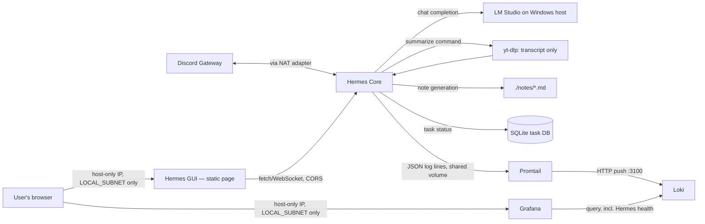

# Architecture

This project runs the official [Hermes Agent](https://hermes-agent.nousresearch.com/) image, repurposed
for learning the OWASP Top 10 for LLM Applications in a controlled VM and Docker lab. Setup steps and gateway concepts are in the
[quickstart](https://hermes-agent.nousresearch.com/docs/getting-started/quickstart).



`B` ("Hermes Core", the `hermes-agent` container) owns all state — `TaskDB`, `soul.py`, `health.py` —
and is the only thing that ever touches `./data/tasks.db`. `G` (the `hermes-gui` container) is pure
presentation: a static page with no database, no secrets, and no network reach of its own. The
browser loads `G`'s page, then talks **directly** to `B`'s published port for everything (chat over
`/ws`, tasks/health/config over `/api/*`) — `G`'s own container is never in that request path. See
"Hermes GUI" below.

`C` defaults to LM Studio running on the Windows host, reached over VirtualBox's host-only adapter
(`host.docker.internal` → `HOST_LM_STUDIO_IP`, same pattern as `ai-cybersecurity-devops-lab`).

**Local models only for now:** no cloud LLM provider is configured or permitted. Changing that needs
a new audit entry and a `docs/SECURITY.md` update.

## Components

| Component | Role | Network exposure |
|---|---|---|
| Hermes Core (`hermes_agent/`, container `hermes-agent`) | discord.py bot + the core's own API/WS adapter (`adapters/web_adapter.py`) + OpenAI-compatible LLM client; sandboxed file tools; transcript/notes/task pipeline; background health heartbeat (`health.py`). Owns `TaskDB` — the only container that ever touches `./data/tasks.db`. | `agent-net` — the one container allowed outbound internet, to the Discord Gateway, LM Studio on the Windows host, and YouTube (for transcript fetching via `yt-dlp`). Also publishes `WEB_CHAT_PORT` inbound (chat WebSocket + `/api/*`), firewalld-restricted to `LOCAL_SUBNET` like Grafana. |
| Loki (`config/loki-config.yaml`) | Log storage | `obs-net` only — no internet, see Trust boundaries |
| Promtail (`config/promtail-config.yaml`) | Tails the shared `hermes-logs` volume, ships lines to Loki | `obs-net` only — no internet |
| Grafana (`dashboards/hermes-overview.json`) | Dashboards over Loki: errors/min, task latency p50/p95, token usage, tool calls, live log stream | `obs-net` + one published port (`GRAFANA_PORT`), reached via the VM's host-only IP and firewalld-restricted to `LOCAL_SUBNET` — no NAT port-forward (see `docs/INSTALL.md` for why) |
| Sandboxed workspace (`hermes_agent/tools.py`, `./workspace`) | File read/write tools the LLM can call | No network role — a filesystem boundary, not a network one |
| Task DB (`hermes_agent/services/task_db.py`, `./data/tasks.db`) | Local SQLite table tracking `Backlog`/`In Progress`/`Completed`/`Failed` task status | No network role; not a real AppFlowy/Affine integration, deliberately — see Trust boundaries |
| Notes service (`hermes_agent/services/notes_service.py`, `./notes/`) | Generates structured markdown notes from a transcript via the LLM, writes them to disk | No network role beyond the LLM call already covered above |
| Hermes GUI (`hermes-gui/`) | Unified browser dashboard — chat, task board, live health, a "coming soon" Reasoning Canvas placeholder. Pure static file server; the browser calls Hermes Core's API directly, this container holds no state/secrets/DB access of its own. | `obs-net` + one published port (`HERMES_GUI_PORT`) — same firewalld-restricted-to-`LOCAL_SUBNET`, no-NAT-forward posture as Grafana. No outbound internet and no reach to `agent-net` either — it never makes a server-side call at all. |

## Chat platform adapters

Built around one shared interface (`hermes_agent/adapters/base.py`'s `ChatAdapter`), so
`hermes_agent/bot/commands.py` contains the actual command logic exactly once, regardless of which
platform a message arrived from — adding a platform later means writing one new adapter module, not
touching command logic.

**Discord and the web chat (via Hermes GUI) are both fully supported.** The web adapter
(`hermes_agent/adapters/web_adapter.py`) runs an embedded FastAPI/uvicorn server inside the same
process as the Discord adapter, exposing a chat WebSocket (`/ws`) plus a small `/api/*` surface the
separate `hermes-gui` container's static page calls. It calls `CommandRouter.handle()` exactly like
Discord does — `summarize`/`task`/plain chat all behave identically — so chatting with Hermes no
longer requires a Discord account, server, or token at all. This adapter has no page of its own
(the old standalone `/` chat page was removed — see "Hermes GUI" below); it's purely a backend now.
No auth of its own; same firewalld-restricted-to-`LOCAL_SUBNET` posture as Grafana and Hermes GUI
(see `WEB_CHAT_PORT` in `.env.example`). Set `WEB_CHAT_ENABLED=false` for a Discord-only deployment.

**Revolt is scaffolded but not currently functional** — the adapter
code exists (`hermes_agent/adapters/revolt_adapter.py`), but `revolt.py` (the only readily-available
Python Revolt library at the time this was built) hard-pins dependencies (`aiohttp==3.7.4.post0`,
`typing-extensions==4.0.1`) that conflict with `openai`'s own requirements — confirmed via two
separate `pip install` failures, not a style choice. This is an accepted, documented gap (see
`hermes_agent/requirements.txt`), not dead code to clean up: setting `REVOLT_TOKEN` without the
package installed raises a clear `RuntimeError` at startup (`hermes_agent/main.py`) rather than a
confusing import crash, and Discord-only operation is entirely unaffected by Revolt's absence.

## The `summarize`/`task` pipeline

1. `!hermes summarize <url>` immediately replies `[Task Queued]` and creates a task row in the local
   SQLite DB (`In Progress`), then hands off to a background `asyncio` task so the bot's
   message-handling loop isn't blocked for however long transcript fetching + note generation takes.
2. `TranscriptService` (`hermes_agent/services/transcript_service.py`) uses `yt-dlp` to fetch
   **existing captions only** — manual or auto-generated — never downloads audio/video and never
   runs speech-to-text. A video with no captions raises `NoTranscriptAvailable`, replied back as a
   clear `[Task Failed]` message rather than hanging or silently doing nothing.
3. `NotesService` (`hermes_agent/services/notes_service.py`) sends the transcript to the same LLM
   backend as plain chat, with a prompt requesting a fixed three-section markdown structure
   (Executive Summary / Key Takeaways & Action Items / Full Reference Notes), and saves the result
   under `./notes/<task_id>-<slug>.md`.
4. The task's status is updated to `Completed` (or `Failed`), and a proof-of-work reply is sent back
   to the originating channel with the note's filename, word count, and processing time.

**Deliberately deferred:** audio-only videos (no existing captions) are not transcribed via Whisper
or any other speech-to-text model. That's a real, scoped-out follow-up, not an oversight — adding it
means a real model/container running inside `agent-net`, which is worth doing once there's an actual
need for it rather than upfront. The current behavior (a clear `[Task Failed]` message) makes that
gap visible rather than hiding it behind a hang or a generic error.

**Transcripts are truncated to fit the LLM's context window, not chunked/summarized in parts.**
`NotesService` truncates to `MAX_TRANSCRIPT_CHARS` (default `20000`, configurable) before sending to
the LLM — confirmed live: an untruncated transcript on an 8K-context local model fails with
`exceeds the available context size`, a hard LLM-side error, not a soft limit. Truncating to the
start of the video, rather than chunking the whole transcript and summarizing each piece, is an
accepted simplification: chunked summarization is real additional complexity (merging partial
summaries coherently) that isn't justified until there's an actual need for full-length coverage of
long videos. A truncated note says so explicitly in its own content, rather than silently covering
less than the user would assume.

## Hermes GUI

`hermes-gui/` is the unified browser dashboard that replaced two separate earlier UIs (a standalone
task dashboard at one port, a standalone plain-chat page at another). It's intentionally a **pure
static file server** (`hermes-gui/app.py` just mounts and serves `static/index.html` — no database,
no secrets, no `.env`, no volumes, no outbound calls of its own). The browser loads that page, then
talks **directly** to Hermes Core's own published port (`WEB_CHAT_PORT`) for everything: chat over
`/ws`, and tasks/health/config over `/api/*` (added to `hermes_agent/adapters/web_adapter.py`, with
`CORSMiddleware` enabled since the GUI's page and Hermes Core's API are different origins by port).
This is what makes the architecture genuinely decoupled — the GUI container is swappable or
scalable independently of Hermes Core, and Hermes Core has zero knowledge of how many GUI instances
(if any) are looking at it.

The `/api/tasks*` routes are thin wrappers around the exact same `TaskDB` instance `main.py` already
constructs for the Discord/`summarize` pipeline — there is now only **one** thing that ever opens
`./data/tasks.db` (Hermes Core itself), not two. The previous standalone `task_dashboard/` container,
which read/wrote that file directly from a second process, has been retired entirely.

**Four tabs today:**
- **Chat** — same WebSocket-based chat as the old standalone page, just inside the unified GUI now.
- **Tasks** — the same 4-column board (Backlog/In Progress/Completed/Failed) the old task-dashboard
  had, now backed by `/api/tasks` instead of a direct file read.
- **Health** — `/api/health` + `/api/config`, polled every ~10s: LLM reachability, soul.md load
  status, uptime, active adapters, and the currently configured model/endpoint/context window
  (read-only — see below). "Real-time" here means "as of the last heartbeat tick"
  (`HEALTH_INTERVAL_SECONDS`), the same cached snapshot `health.HealthState` also feeds into the
  Grafana heartbeat event — opening this tab never itself triggers an extra LLM ping.
- **Reasoning Canvas** — a labeled "coming soon" placeholder, not faked data. It needs an actual
  LLM tool-calling loop first: `WorkspaceTools` (read/write/list workspace file) is fully built and
  self-logs via `metrics.log_tool_call`, but `commands.py`'s `_call_llm` never passes a `tools=`
  schema to the chat-completion call or parses `tool_calls` back — the LLM cannot actually invoke a
  tool today, so there is nothing yet to trace live. Building that loop and wiring this tab to it is
  a tracked follow-up, not done in this pass.

**Model endpoint configuration is read-only, deliberately.** `/api/config` returns
`llm_api_base`/`llm_model`/`llm_context_window`/`command_prefix` — never `llm_api_key` or any other
secret. Making this live-editable from the GUI was considered and explicitly deferred: it would mean
a new write-path that can redirect where Hermes's LLM traffic goes, exposed on a port with no
app-level authentication (see Trust boundaries below) — real enough scope and risk to warrant its
own pass later rather than bundling it in here. For now, changing the LLM endpoint still means
editing `.env` and restarting `hermes-agent`, same as before.

**Deliberately still not a queue Hermes drains.** Adding a task from the GUI (or Discord) puts it in
`Backlog`, but `hermes-agent` has no background poller watching for new `Backlog` rows and does not
act on one on its own — it only ever creates/updates tasks in direct response to a Discord/web chat
command (`_handle_task`/`_handle_summarize` in `hermes_agent/bot/commands.py`). This is scoped out
for now rather than an oversight — see the tool-calling note above; autonomous task pickup is the
same class of follow-up work.

## Hermes health

Two things were previously invisible and are now tracked the same way token usage already is — via
`metrics.py` events shipped through Promtail/Loki to a "Hermes health" panel row in
`dashboards/hermes-overview.json` (historical trend view), and as a real-time snapshot in Hermes
GUI's Health tab (`health.HealthState`, see "Hermes GUI" above — same underlying heartbeat, two
different views of it):

1. **Persona/system-prompt status.** `hermes_agent/soul.py` loads `config/soul.md` once at startup
   as `CommandRouter`'s system prompt (`soul_path`/`SOUL_MD_PATH`, see `.env.example`). If the file
   is missing or empty, it silently falls back to a generic built-in default (`DEFAULT_SOUL`) rather
   than crashing — a working but depersonalized bot is better than a crash-looping one. "Silently"
   is the problem that's fixed here: the `soul_loaded` field on the `health_heartbeat` event (and a
   one-time `soul_loaded` event at startup) makes that fallback visible in Grafana instead of only
   discoverable by reading logs.
2. **Context window usage.** There is still no persistent conversation memory — every chat call
   sends only the system prompt + that one message, nothing before it (see the "Discord message ->
   LLM" trust boundary below; this hasn't changed — it's just visible now). What *is* new is `hermes_agent/health.py`
   estimating token usage per call (`~len(text)/4`, a heuristic, not a real tokenizer — see its
   module docstring) against `LLM_CONTEXT_WINDOW` (informational only, keep it in sync by hand with
   whatever model is actually loaded) and logging it as `context_usage`/`context_pct`. A context
   overflow from the LLM backend is also now distinguished as its own `llm_context_overflow`
   `error_type` in `commands.py`, rather than folding into the generic `llm_api_error` bucket —
   visible as its own Grafana panel instead of hidden inside "something errored."

A background heartbeat (`health.heartbeat_loop`, started alongside the chat adapters in `main.py`,
interval `HEALTH_INTERVAL_SECONDS`) also pings the configured LLM backend (`llm.models.list()`) and
logs reachability, uptime, and which adapters are active — so "is Hermes actually healthy right now"
is answerable from Grafana without SSHing in and tailing logs.

**Deliberately not built here:** auto-restart, automatic model fallback, or any other action taken
*because of* a health signal. This is observability only, same as the rest of the Grafana stack —
acting on these signals (e.g. alerting, or truncating/rejecting a request that would overflow
context) is a real follow-up, not something to bolt on silently alongside a health dashboard.

## Rogue-entity detection: decoupled sensor (decided, not yet built)

Hermes never scans the network. A separate **sensor** container does, and Hermes only reads its
output.

```
Lab subnet  ->  sensor (read-only discovery, strict scan scope)
            ->  findings volume (sensor writes, Hermes mounts read-only)
            ->  Hermes (schema-validated ingest, no scan tools, no raw sockets)
```

- **Sensor:** runs predetermined discovery jobs on a timer. Scan targets are an explicit allowlist
  of the lab subnet. It has its own firewall scope and no route to the LLM or the internet.
- **Findings:** structured JSON, validated against a schema before Hermes reads them. Hostnames,
  banners, and service responses are untrusted data, so they're treated as indirect prompt
  injection (LLM01), not instructions.
- **On-demand scans:** Hermes doesn't run them. If one is needed, Hermes publishes a request to a
  job queue. A controller validates the arguments against the allowlist, then signals the sensor.
- **Why:** Hermes can't be steered into reconnaissance by prompt injection (LLM06), and a flaw in a
  scanning tool stays inside the disposable sensor container.
- **Cost:** no real-time probing. Hermes works from the latest completed scan, which can be stale.
- **Firewall:** the sensor's scan access and its findings path are a new firewall change. That
  entry gets written to `Projects\cv-hermes-audit-log\CHANGELOG.md` before it's applied.

## Trust boundaries

- **Chat message (Discord or web) → LLM:** every inbound message, regardless of which adapter it
  arrived through, is treated as untrusted input to the model, not as instructions to the agent
  process itself. The agent never executes shell commands or arbitrary code derived from a message —
  the only actions available to the LLM are the three tools in `config/hermes.example.yaml`'s
  `tools.allowed` list.
- **LLM response → filesystem:** `hermes_agent/tools.py`'s `WorkspaceTools._resolve()` is the one
  place a prompt-injected or hallucinated file path (e.g. `../../etc/passwd`) gets checked and
  rejected, on every call, not just at startup. This is the sandbox boundary for the one tool
  category the agent has.
- **Secrets → config:** `hermes_agent/config.py` reads `DISCORD_TOKEN` and `LLM_API_KEY` from the
  environment only, never from `hermes.yaml`. A leaked or accidentally-committed YAML config file
  cannot leak a credential, because the credential was never representable there.
- **agent-net vs. obs-net:** the agent is not air-gapped. Its only internet route is the Squid egress
  proxy, limited to `discord.com` and `gateway.discord.gg`, enforced by firewalld
  (`scripts/01_apply_hermes_egress_policy.sh`). `obs-net` (Loki/Promtail/Grafana) has no
  internet route at all. See `docs/SECURITY.md` for the accepted risks.
- **User-supplied URL → outbound fetch:** the old `summarize <url>` pipeline is retired with the custom
  `hermes_agent/` code. Any future fetch tool is subject to the egress allowlist above, so it can only
  reach the two Discord hosts.
- **Neither Hermes GUI nor Hermes Core's API has authentication of its own:** same model as
  Grafana — both rely entirely on firewalld restricting `HERMES_GUI_PORT`/`WEB_CHAT_PORT` to
  `LOCAL_SUBNET`, not an app-level login. Anyone who can reach that subnet can chat with Hermes
  (including running `summarize`/`task`) and view/add/edit/delete tasks. Acceptable for a
  single-user home lab; do not widen either firewalld rule without adding real auth first. This is
  also exactly why `/api/config` is read-only (see "Hermes GUI" above) — an unauthenticated port is
  not where a live LLM-endpoint-redirect control belongs.
- **One writer, one SQLite file — by design now, not just by convention:** only `hermes-agent` ever
  opens `./data/tasks.db` (the retired `task_dashboard/` used to be a second direct writer; it's now
  an `/api/tasks` client like everything else). WAL mode + a 10s busy timeout are still set in
  `task_db.py` — cheap insurance in case of overlapping requests within hermes-agent's own process,
  not a multi-process concurrency requirement anymore.
- **LLM-generated note content → disk:** `NotesService` writes the LLM's markdown output to disk
  without sanitizing it first. This is acceptable because the output is plain text saved to a `.md`
  file, never executed, never interpolated into a shell command, and never served back as HTML — the
  worst case is a note containing unexpected/low-quality text, not a code-execution or injection
  path.
